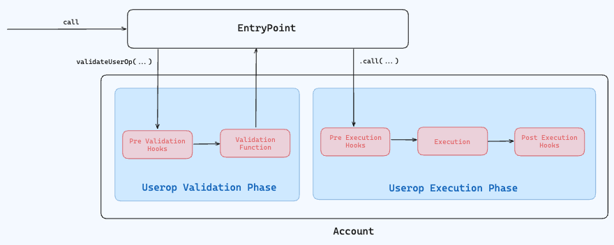
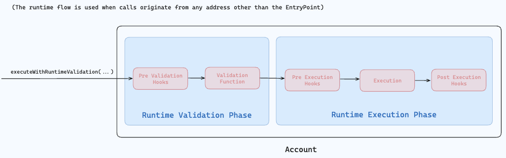

# Modular Account

[![gh_ci_badge]][gh_ci_link]
[![tg_badge]][tg_link]

[gh_ci_badge]: https://github.com/alchemyplatform/modular-account/actions/workflows/test.yml/badge.svg
[gh_ci_link]: https://github.com/alchemyplatform/modular-account/actions/workflows/test.yml
[tg_badge]: https://img.shields.io/endpoint?color=neon&logo=telegram&label=chat&url=https://mogyo.ro/quart-apis/tgmembercount?chat_id=modular_account_standards
[tg_link]: https://t.me/modular_account_standards


Alchemy's Modular Account is a maximally modular, upgradeable smart contract account that is compatible with [ERC-4337](https://eips.ethereum.org/EIPS/eip-4337) and [ERC-6900](https://eips.ethereum.org/EIPS/eip-6900).

> [!WARNING]  
> **This branch contains changes that are under development.** To use the latest audited version make sure to use the correct commit. The tagged versions can be found in the [releases](https://github.com/alchemyplatform/modular-account/releases).

## Overview

This repository contains:

- ERC-6900 compatible account implementations: [src/account](src/account)
- Account factory: [src/factory](src/factory)
- Helper contracts and libraries: [src/helpers](src/helpers), [src/libraries](src/libraries)
- ERC-6900 compatible modules: [src/modules](src/modules)
  - Validation modules:
    - [SingleSignerValidationModule](src/modules/validation/SingleSignerValidationModule.sol): Enables validation for a single signer (EOA or contract).
    - [WebAuthnValidationModule](src/modules/validation/WebAuthnValidationModule.sol): Enables validation for passkey signers.
  - Permission-enforcing hook modules:
    - [AllowlistModule](src/modules/permissions/AllowlistModule.sol): Enforces ERC-20 spend limits and address/selector allowlists.
    - [NativeTokenLimitModule](src/modules/permissions/NativeTokenLimitModule.sol): Enforces native token spend limits.
    - [PaymasterGuardModule](src/modules/permissions/PaymasterGuardModule.sol): Enforces use of a specific paymaster.
    - [TimeRangeModule](src/modules/permissions/TimeRangeModule.sol): Enforces time ranges for a given entity.

The contracts conform to these ERC versions:

- ERC-4337: [v0.7.0](https://github.com/eth-infinitism/account-abstraction/blob/releases/v0.7/erc/ERCS/erc-4337.md)
- ERC-6900: [v0.8.0](https://github.com/ethereum/ERCs/blob/c081c445424505d549e0236650917a2aaf3c5743/ERCS/erc-6900.md)

## Development

### Building and testing

```bash
# Install dependencies
forge install
pnpm install

# Build
forge build
FOUNDRY_PROFILE=optimized-build forge build --sizes

# Lint
pnpm lint

# Format
pnpm fmt

# Coverage
pnpm lcov

# Generate gas snapshots
pnpm gas

# Test
pnpm test
forge test -vvv
```

### Deployment

Deployment scripts can be found in the `scripts/` folder, and depend on reading parameters from your local environment or from `.env`. A sample for the required fields can be found at `.env.example`. Note that some have specific foundry profiles needed for deployment.

You will also need provide a wallet to use for deployment. Available options can be found [here](https://book.getfoundry.sh/reference/forge/forge-script#wallet-options---raw).

```bash
FOUNDRY_PROFILE=<profile> forge script script/<deploy_script>.s.sol --rpc-url $RPC_URL --broadcast
```

## Features overview

### Features

Modular Account can:

1. Deploy contracts via `CREATE` or `CREATE2`.
2. Receive ERC-721 and ERC-1155 tokens.
3. Use applications that depend on ERC-1271 contract signatures.
4. Use applications that use the ERC-165 introspection standard.
5. Be upgradeable to or from most other smart contract account implementations.
6. Be customized in many ways. All customization options can be found [here](./2-customizing-your-modular-account.md).

#### ERC-1271 contract signatures support

Certain applications such as Permit2 or Cowswap use the ERC-1271 contract signatures standard to determine if a smart contract has approved a certain action. Modular Account implements ERC-1271 to allow smart accounts to use these applications.

#### Upgradeability

When modular accounts are created from the factory, an ERC-1967 proxy contract is deployed. Users can update the implementation their proxy points to to choose which smart account implementations to use. Modular Account adheres to the ERC-7201 namespaced storage standard to prevent storage collisions when updating between different implementations.

### Customizing your Modular Account

Modular Account can be customized by:

1. Installing execution functions to add custom execution logic to run, or uninstalling to remove them
2. Installing validations to apply custom validation logic for one or all execution functions, or uninstalling to remove them
3. Installing pre validation hooks that are attached to module entities, or removing them
4. Installing execution hooks that are attached to execution functions, or removing them
5. Installing execution hooks that are attached to module entities, or removing them

#### Lifecycle of a user operation



#### Lifecycle of a runtime call



#### Pre-validation hooks

Pre validation hooks are run before validations. Pre-validation hooks are necessary to perform gas related checks for User Operations (session key gas limits, or gas metering taking into account paymaster usage). These checks must happen in the validation phase since a validation success would allow the entrypoint to charge gas for the user operation to the account.

#### Validations

Validations are usually signature validation functions (secp256k1, BLS, WebAuthn, etc). While it’s feasible to implement signature validation as a pre-validation hook, it’s more efficient and ergonomic to do these in validations since it allows us to apply permissions per module entity using execution hooks. In ERC-4337, accounts can return validation data that’s not 0 or 1 to signal the usage of a signature aggregator.

#### Execution hooks

Execution hooks are useful for applying permissions on execution functions to limit the set of possible actions that can be taken. Post-execution hooks are useful for checking the final state after an execution. Pre and post-execution hook pairs are useful for measuring differences in state due to an execution. For example, you could use a pre and post execution hook pair to enforce that swap outputs from a DCA swap performed by a session key fall within a some tolerance price determined by a price oracle.

Execution hooks can be associated either with a module entity to apply permissions on that specific entity, or with an execution selector on the account to apply global restrictions on the account across all entities. A example of a useful global restriction would be to block NFT transfers for NFTs in cold storage, or to apply resource locks.

#### Execution functions

Execution hooks are applied across execution functions. Modular account comes with native execution functions such as `installValidation`, `installExecution`, or `upgradeToAndCall`. However, you could customize the account by installing additional execution functions. After a new execution is installed, when the account is called with that function selector, the account would forward the call to the module associated with that installed execution. An example of a useful execution functions would be to implement callbacks for the account to be able to take flash loans.

## Security

### Audits

Our audit reports can be found in [audits](/audits). The filenames for the reports have the format: `YYYY-MM-DD_VENDOR_FFFFFFF.pdf`, where `YYYY-MM-DD` refers to the date on which the final report was received, `VENDOR` refers to the conductor of the audit, and `FFFFFFF` refers to the short commit hash on which the audit was conducted.

### Bug bounty program

Details of our bug bounty program can be found at https://hackerone.com/alchemyplatform.

### Other security considerations

This section contains other security considerations that developers should be aware of when using a Modular Account besides informational issues highlighted in the security audits.

#### Off-chain safety checks

A client should perform the following off-chain checks when interacting with a modular account:

1. When installing a validation, clients should ensure that the entity id has not been previously used in the account
2. When upgrading to a Modular Account, clients should check if the proxy used to be a Modular Account by checking the value of the `initialized` variable at the Modular Account namespaced storage slot within the proxy. If so, any `initializer` functions called would not work, and the configuration of that past Modular Account might be different from the current ownership configuration.
3. When upgrading to a Modular Account, clients should check that the account is an ERC-1967 proxy by checking the ERC-1822 `proxiableUUID` slot.
4. When installing execution function, clients should check that it does not collide with any native function selectors.
5. Clients should ensure that deferred action nonces are unique without dependencies. One possible scheme is to use unix timestamps as part of the nonce.

#### Proxy pattern and initializer functions

Initializer functions are not guarded by any access control modifier. If accounts are not used in a proxy pattern, during the account’s constructor, as per Openzeppelin’s implementation of `Initializable`, initializer functions are able to be reentered. This design choice can be used by an attacker to install additional validations to take over a user’s account.

#### Initializer functions with EIP-7702

When using EIP-7702, the delegate destination should only be the `SemiModularAccount7702` implementation, and not any of the other account variants. Otherwise, if the delegate destination is set to an account with an unprotected initializer function, an attacker will be able to take over the account.

### Semi modular account considerations

`SemiModularAccountBytecode` (`SMABytecode`) is the cheapest account to deploy. It can only be used for new account deployment, and **should NOT** be used for account upgrades due to requiring specific proxy bytecode.

#### Deferred actions

In order for a deferred action to be run at validation, in addition to special encoding (which includes the validation to validate the deferred action itself), it must not break ERC-4337 validation-time rules. For instance, this means that any execution hooks on `installValidation` must comply with EIP-7562.

#### Signature validation flag enablement

The `isSignatureValidation` flag meant to allow a validation function to validate ERC-1271 signatures. Developer should note that for Modular Account this is a very powerful capability to grant as it allows validation functions to approve deferred actions on the account.

## Acknowledgements

The contracts in this repository adhere to the ERC-6900 specification, and are heavily influenced by the design of the ERC-6900 reference implementation.

## License

The contracts provided in this repository in [src](src) are licensed under the GNU General Public License v3.0, included in our repository in [LICENSE-GPL](LICENSE-GPL).

Alchemy Insights, Inc., 548 Market St., PMB 49099, San Francisco, CA 94104; legal@alchemy.com
